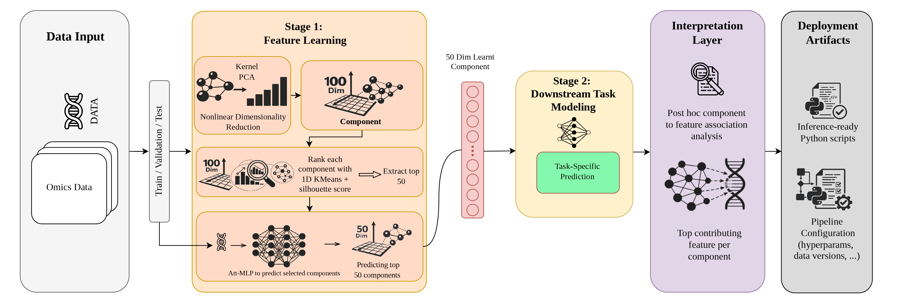

# OmicSieve

OmicSieve is a generalized unsupervised representation-learning pipeline for omics data. It uses non-linear compression to convert high-dimensional molecular profiles into compact embeddings that can be reused for many downstream tasks.

The saved OmicSieve MLP model lets users project their own samples into the same compressed embedding space. Those embeddings can then be used as input features for any downstream analysis or model, such as binary or multi-class classification, regression, clustering, survival analysis, visualization, or biomarker discovery.

Cancer grade and TP53 mutation prediction from RNA-seq gene expression are included as example downstream classifiers built on top of the learned embeddings. OmicSieve itself is not limited to binary classification.



## What OmicSieve Provides

- A saved non-linear MLP encoder for predicting compressed omics embeddings.
- A fixed feature-order file so input features can be reordered correctly.
- Component-to-gene mapping files for interpreting compressed embeddings.
- Example downstream XGBoost models for:
  - **Cancer grade**: low-risk (`0`) vs high-risk (`1`)
  - **TP53 mutation**: wild-type (`0`) vs mutated (`1`)

## Package Contents

Only a few files are required to generate compressed embeddings from new samples. After downloading the encoder weights, the expected layout is:

```text
deployment_grade/
|-- gene_order.json
|-- scaler.pkl
|-- kpca_rbf/
|   `-- component_predictor_attention_mlp.pt
`-- kpca_cosine/
    `-- component_predictor_attention_mlp.pt

deployment_tp53/
|-- gene_order.json
|-- scaler.pkl
|-- kpca_rbf/
|   `-- component_predictor_attention_mlp.pt
`-- kpca_cosine/
    `-- component_predictor_attention_mlp.pt
```

`gene_order.json` aligns incoming features, `scaler.pkl` applies the training normalization, and `component_predictor_attention_mlp.pt` generates the 50-dimensional compressed embedding. Configuration files, ranking plots, and training curves are useful for analysis and reproducibility, but are not needed by `predict.py` to embed new samples.

Optional files for `--mode predict`:

- A downstream classifier model is required only for `--mode predict`:

```text
deployment_grade/KPCA_RBF/xgboost_grade_predictor_cv.pkl
deployment_grade/KPCA_COSINE/xgboost_grade_predictor_cv.pkl
deployment_tp53/KPCA_RBF/xgboost_tp53_predictor_cv.pkl
deployment_tp53/KPCA_COSINE/xgboost_tp53_predictor_cv.pkl
```

- Component-to-gene mapping files can be provided separately for grade and TP53 interpretation.

## Download Large Files

```bash
mkdir -p deployment_grade/kpca_rbf deployment_grade/kpca_cosine
mkdir -p deployment_tp53/kpca_rbf deployment_tp53/kpca_cosine

# Grade encoder - RBF
gdown 1Ap7CXaGOjPunefzySrFsuVH4jF6Q_BHS -O deployment_grade/kpca_rbf/component_predictor_attention_mlp.pt
# Grade KPCA - RBF
gdown 1JJoa-3b3J1rgyHNcXNj3M1yojE7I3hkE -O deployment_grade/kpca_rbf/kpca.pkl
# Grade encoder - Cosine
gdown 1GLLGWkEVakDsrQtvrwnSwJEVHejCHC-W -O deployment_grade/kpca_cosine/component_predictor_attention_mlp.pt
# Grade KPCA - Cosine
gdown 1wi3hnXcX3CycUcv4eSV58vZyBuCdsdpR -O deployment_grade/kpca_cosine/kpca.pkl

# TP53 encoder - RBF
gdown 1I0HNoTgDUVpG5bwAp8GX1_g3NoukLXVA -O deployment_tp53/kpca_rbf/component_predictor_attention_mlp.pt
# TP53 KPCA - RBF
gdown 1TKa-YrBWl0UUK_CORors3q7kRAjyEkXK -O deployment_tp53/kpca_rbf/kpca.pkl
# TP53 encoder - Cosine
gdown 145GibC68P-g-Yumf_L1h-cyrl90dhGIH -O deployment_tp53/kpca_cosine/component_predictor_attention_mlp.pt
# TP53 KPCA - Cosine
gdown 1-fRfVsm8GU9kW1Q5Jrgxqi58TACaBurP -O deployment_tp53/kpca_cosine/kpca.pkl
```

## Input Format

Input CSV files should have samples as rows and omics features as columns. For the provided examples, these features are RNA-seq genes. The first column is treated as the sample ID.

```csv
sample_id,TP53,BRCA1,BRCA2,...
TCGA-02-0047-01,4.31,2.18,3.92,...
TCGA-02-0055-01,5.02,2.44,4.10,...
```

`predict.py` reorders input columns to the provided training feature order. The RNA-seq example model expects 19,310 genes.

```bash
python predict.py --task grade --mode predict --input your_data.csv --output grade_predictions.csv --gene-order gene_order.json
```

## Install

```bash
pip install numpy pandas scikit-learn xgboost torch joblib
```

## Usage

Predict reusable compressed embeddings:

```bash
python predict.py --task grade --mode components --input your_data.csv --output grade_components.csv
```

Embeddings can also be saved as compressed NumPy archives:

```bash
python predict.py --task grade --mode components --input your_data.csv --output grade_components.npz
```


The output embeddings can be used for any downstream task. For example, you can train your own classifier or regressor on `grade_components.csv`:

```python
import pandas as pd
from sklearn.ensemble import RandomForestClassifier

X = pd.read_csv("grade_components.csv", index_col=0)
y = pd.read_csv("your_labels.csv", index_col=0)["label"]

model = RandomForestClassifier(random_state=42)
model.fit(X, y)
```

Predict cancer grade:

```bash
python predict.py --task grade --mode predict --input your_data.csv --output grade_predictions.csv
```

Predict TP53 mutation status:

```bash
python predict.py --task tp53 --mode predict --input your_data.csv --output tp53_predictions.csv
```

Useful options:

```bash
--method kpca_rbf      # or kpca_cosine
--model-root PATH      # model artifact folder
--gene-order PATH      # JSON/TXT/CSV training feature order
```

Default methods:

- Grade: `kpca_rbf`
- TP53: `kpca_cosine`

## Output

Component mode writes 50 compressed embedding columns:

```text
pred_component_0 ... pred_component_49
```

Prediction mode writes:

- Grade: `grade_prediction`, `high_risk_probability`
- TP53: `tp53_prediction`, `tp53_mutation_probability`


## Results

Hold-out test performance:

| Task | Method | Accuracy | Balanced accuracy | Weighted F1 |
| --- | --- | ---: | ---: | ---: |
| Grade | KPCA RBF | 0.8827 | 0.8691 | 0.8940 |
| TP53 | KPCA Cosine | 0.8352 | 0.8329 | 0.8364 |

5-fold cross-validation out-of-fold performance:

| Task | Method | Accuracy | Balanced accuracy | Weighted F1 |
| --- | --- | ---: | ---: | ---: |
| Grade | KPCA RBF | 0.8749 | 0.8296 | 0.8857 |
| TP53 | KPCA Cosine | 0.8419 | 0.8385 | 0.8429 |

## Notes

- The RNA-seq example model expects 19,310 gene-expression features.
- Use the provided `gene_order.json` to align input features before inference.
- Extra input columns are ignored when `gene_order.json` is provided.
- Missing required features stop inference with an error.
- For new downstream tasks, use `--mode components` and train your task-specific model on the generated embeddings.
